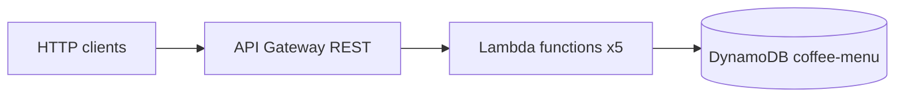

# Coffee Shop Menu API (Serverless CRUD)

Public demo REST API for a **coffee shop menu**: create, list, read, update, and delete items stored in **Amazon DynamoDB**. Integration uses **Amazon API Gateway (REST)** → **AWS Lambda** (Node.js 20, TypeScript) → **DynamoDB**. There is **no** API Gateway **service proxy / direct DynamoDB integration** — all persistence goes through Lambda code (`@aws-sdk/lib-dynamodb`).

## Architecture



- **IaC**: [Serverless Framework](https://www.serverless.com/) v3, YAML split under [`config/`](./config/) (`functions`, `provider`, `resources`, `custom`).
- **Packaging**: [`serverless-esbuild`](https://www.npmjs.com/package/serverless-esbuild) bundles each function with tree-shaking and optional minification.

## API

Base URL after deploy: API Gateway stage URL printed by `serverless deploy` (path prefix includes stage name).

| Method | Path | Lambda | Description |
|--------|------|--------|-------------|
| `POST` | `/menu/items` | `createMenuItem` | Create item |
| `GET` | `/menu/items` | `listMenuItems` | List items (`?category=espresso` optional) |
| `GET` | `/menu/items/{id}` | `getMenuItem` | Get one |
| `PUT` | `/menu/items/{id}` | `updateMenuItem` | Partial update |
| `DELETE` | `/menu/items/{id}` | `deleteMenuItem` | Delete |

### Menu item model

- **id**: UUID (string)
- **name**, **description**, **priceCents** (integer), **category** (`espresso` \| `brew` \| `tea` \| `pastry` \| `seasonal` \| `other`), **available** (boolean)
- **createdAt**, **updatedAt**: ISO 8601

### Example `curl`

Replace `BASE` with your deployed URL.

```bash
# Create
curl -sS -X POST "$BASE/menu/items" \
  -H "Content-Type: application/json" \
  -d '{"name":"Oat Flat White","priceCents":495,"category":"espresso","description":"Double ristretto, oat milk"}'

# List
curl -sS "$BASE/menu/items"

# List by category
curl -sS "$BASE/menu/items?category=pastry"

# Get / update / delete (replace ITEM_ID)
curl -sS "$BASE/menu/items/ITEM_ID"
curl -sS -X PUT "$BASE/menu/items/ITEM_ID" \
  -H "Content-Type: application/json" \
  -d '{"priceCents":525,"available":true}'
curl -sS -X DELETE "$BASE/menu/items/ITEM_ID"
```

### Postman

1. Import [`docs/postman/coffee-shop-api.postman_collection.json`](./docs/postman/coffee-shop-api.postman_collection.json) (**Import → File**).
2. En la colección, variables **`baseUrl`** y **`itemId`**: deja `baseUrl` como tu URL de stage `dev` (la que imprime `serverless deploy`). **`itemId`** queda vacío hasta que ejecutes **Create menu item** (el test guarda el UUID automáticamente).
3. Orden sugerido: Create → List → Get → Update → Delete.

### OpenAPI (Swagger) en el navegador

- Archivo: [`docs/openapi.yaml`](./docs/openapi.yaml).
- Abre [Swagger Editor](https://editor.swagger.io/), **File → Import file** y elige `openapi.yaml`, o pega el contenido.
- En la sección **servers**, cambia la URL si redeployaste y tu API ID cambió.
- Pulsa **Try it out** en cada operación (misma URL base que Postman).

También puedes **Import → OpenAPI** en Postman desde ese YAML.

## Prerequisites

- Node.js **20+** (see [`.nvmrc`](./.nvmrc))
- AWS credentials with permissions for Serverless deploy (CloudFormation, Lambda, API Gateway, IAM role creation for the stack, DynamoDB)

## Local commands

```bash
npm ci
npm run build      # TypeScript check (noEmit)
npm run lint
npm test
npx serverless deploy --stage dev
```

Optional helper (Git Bash / macOS / Linux):

```bash
chmod +x scripts/deploy.sh
./scripts/deploy.sh dev
./scripts/deploy.sh prod
```

Remove a stage:

```bash
npm run remove:dev
npm run remove:prod
```

## Default branch: `master`

CI/CD está configurado para **`master`** (requisito típico del challenge: deploy al hacer push a `master`).

1. En GitHub: **Settings → General → Default branch** → cambia a **`master`** (si aún está en `main`).
2. Si en tu máquina sigues en `main`, renómbrala y publícala:

```bash
git branch -m main master
git push -u origin master
```

Luego en GitHub puedes borrar la rama remota `main` si ya no la necesitas (**Branches**).

## CI/CD (GitHub Actions)

Two workflows:

1. **[`.github/workflows/ci.yml`](./.github/workflows/ci.yml)** — on every push / PR to **`master`**: install, typecheck, lint, tests, `serverless print` (no AWS deploy).
2. **[`.github/workflows/deploy.yml`](./.github/workflows/deploy.yml)** — **multi-stage** deployments:
   - **Push** to **`master`**: deploy **`dev`** (job `deploy-dev`, GitHub Environment **`development`**).
   - **Manual** “Run workflow”: choose **`dev`** or **`prod`** (job `deploy-manual`; Environment **`development`** or **`production`**).

### Repository setup

1. Create GitHub Environments **`development`** and **`production`** (*Settings → Environments*). Optionally add required reviewers on **`production`**.
2. Add secrets (per environment or repository — this template expects **repository** secrets used by both jobs):

   - `AWS_ACCESS_KEY_ID`
   - `AWS_SECRET_ACCESS_KEY`

   Deploy IAM user/role needs typical Serverless deploy rights in **us-east-1** (see [`config/provider.yml`](./config/provider.yml) region).

### Screenshots for reviewers

See **[`docs/ci-cd/README.md`](./docs/ci-cd/README.md)** for the filenames and what each screenshot should show (`01-github-actions-ci.png` … `04-workflow-dispatch-prod.png`). After your pipelines run, drop the PNGs into [`docs/ci-cd/`](./docs/ci-cd/) and paste markdown images here if you want them inline in this README.

## Walkthrough video

Record a short **Loom** (or similar) explaining:

- Domain choice (coffee shop menu) and API behaviour  
- [`serverless.yml`](./serverless.yml) + [`config/*.yml`](./config/)  
- Lambda handlers under [`src/handlers/`](./src/handlers/) and DynamoDB access in [`src/services/menuRepository.ts`](./src/services/menuRepository.ts)  
- CI/CD workflows and GitHub Environments  

**Loom link:** _add your URL here after recording_

## Challenge checklist

- [x] Node.js / TypeScript  
- [x] Serverless IaC, DynamoDB table in stack  
- [x] REST API Gateway + **5 Lambdas** (CRUD + list), **no** API Gateway → DynamoDB proxy integration  
- [x] GitHub Actions: deploy on push to **`master`**, plus manual **`prod`**  
- [ ] Public repo + **frequent commits** (keep iterating after clone)  
- [ ] **Screenshots** + **Loom** linked above  
