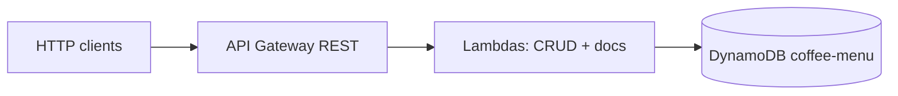

# Coffee Shop Menu API (Serverless CRUD)

Public demo REST API for a **coffee shop menu**: create, list, read, update, and delete items stored in **Amazon DynamoDB**. Traffic flows **Amazon API Gateway (REST)** → **AWS Lambda** (Node.js 20, TypeScript) → **DynamoDB**. There is **no** API Gateway **service proxy / direct DynamoDB integration** — persistence is handled only in Lambda (`@aws-sdk/lib-dynamodb`).

## Architecture



- **IaC**: [Serverless Framework](https://www.serverless.com/) v3, YAML split under [`config/`](./config/) (`functions`, `provider`, `resources`, `custom`).
- **Packaging**: [`serverless-esbuild`](https://www.npmjs.com/package/serverless-esbuild) bundles each function with tree-shaking and optional minification.

## API

After deploy, use the API Gateway stage URL printed by `serverless deploy` (the path includes the stage name, e.g. `/dev`).

| Method | Path | Lambda | Description |
|--------|------|--------|-------------|
| `POST` | `/menu/items` | `createMenuItem` | Create item |
| `GET` | `/menu/items` | `listMenuItems` | List items (optional `?category=espresso`) |
| `GET` | `/menu/items/{id}` | `getMenuItem` | Get one |
| `PUT` | `/menu/items/{id}` | `updateMenuItem` | Partial update |
| `DELETE` | `/menu/items/{id}` | `deleteMenuItem` | Delete |
| `GET` | `/docs` | `swaggerDocs` | **Swagger UI** — browse endpoints and **Try it out** in the browser |
| `GET` | `/openapi.yaml` | `swaggerDocs` | OpenAPI document (used by Swagger UI; server URL injected at runtime) |

Example (replace with your API host and stage):

`https://YOUR_API_ID.execute-api.us-east-1.amazonaws.com/dev/docs`

### Menu item model

- **id**: UUID (string)
- **name**, **description**, **priceCents** (integer), **category** (`espresso` \| `brew` \| `tea` \| `pastry` \| `seasonal` \| `other`), **available** (boolean)
- **createdAt**, **updatedAt**: ISO 8601 timestamps

### Example `curl`

Replace `BASE` with your deployed base URL (including stage).

```bash
# Create
curl -sS -X POST "$BASE/menu/items" \
  -H "Content-Type: application/json" \
  -d '{"name":"Oat Flat White","priceCents":495,"category":"espresso","description":"Double ristretto, oat milk"}'

# List
curl -sS "$BASE/menu/items"

# List by category
curl -sS "$BASE/menu/items?category=pastry"

# Get / update / delete (replace ITEM_ID)
curl -sS "$BASE/menu/items/ITEM_ID"
curl -sS -X PUT "$BASE/menu/items/ITEM_ID" \
  -H "Content-Type: application/json" \
  -d '{"priceCents":525,"available":true}'
curl -sS -X DELETE "$BASE/menu/items/ITEM_ID"
```

### Postman

1. Import [`docs/postman/coffee-shop-api.postman_collection.json`](./docs/postman/coffee-shop-api.postman_collection.json) (**Import → File**).
2. Collection variables **`baseUrl`** and **`itemId`**: set **`baseUrl`** to your stage URL (same as in `serverless deploy` output). Leave **`itemId`** empty until you run **Create menu item** — the request test saves the returned UUID automatically.
3. Suggested order: Create → List → Get → Update → Delete.

### OpenAPI / Swagger in the browser

**Option A — served by the API (recommended)**  
After deploy, open **`GET /docs`** in a browser (see table above). Swagger UI loads **`/openapi.yaml`** from the same API Gateway; the deployment base URL is injected so **Try it out** works without editing the YAML.

**Option B — Swagger Editor**  
Import [`docs/openapi.yaml`](./docs/openapi.yaml) into [Swagger Editor](https://editor.swagger.io/) and adjust **servers** if your endpoint changed.

You can also **Import → OpenAPI** in Postman from that YAML.

## Prerequisites

- Node.js **20+** ([`.nvmrc`](./.nvmrc))
- AWS credentials able to run Serverless deploy (CloudFormation, Lambda, API Gateway, IAM for the stack, DynamoDB)

## Local commands

```bash
npm ci
npm run build      # TypeScript check (noEmit)
npm run lint
npm test
npx serverless deploy --stage dev
```

Optional helper (Git Bash / macOS / Linux):

```bash
chmod +x scripts/deploy.sh
./scripts/deploy.sh dev
./scripts/deploy.sh prod
```

Remove a stack:

```bash
npm run remove:dev
npm run remove:prod
```

## Default branch: `master`

GitHub Actions are configured for **`master`** (common challenge requirement: deploy on push to `master`).

1. On GitHub: **Settings → General → Default branch** → set **`master`** if it is still `main`.
2. If your local branch is still `main`, rename and push:

```bash
git branch -m main master
git push -u origin master
```

You may delete the remote `main` branch when you no longer need it (**Branches**).

## CI/CD (GitHub Actions)

Two workflows:

1. **[`.github/workflows/ci.yml`](./.github/workflows/ci.yml)** — on every push / PR to **`master`**: install, typecheck, lint, tests, `serverless print` (no AWS deploy).
2. **[`.github/workflows/deploy.yml`](./.github/workflows/deploy.yml)** — multi-stage deploy:
   - **Push** to **`master`**: deploy **`dev`** (job `deploy-dev`, GitHub Environment **`development`**).
   - **Manual** “Run workflow”: choose **`dev`** or **`prod`** (job `deploy-manual`; Environment **`development`** or **`production`**).

### Repository setup

1. Create GitHub Environments **`development`** and **`production`** (**Settings → Environments**). Optionally add required reviewers on **`production`**.
2. Add secrets (repository or environment secrets — this template uses **repository** secrets for both deploy jobs):

   - `AWS_ACCESS_KEY_ID`
   - `AWS_SECRET_ACCESS_KEY`

   The IAM principal needs typical Serverless deploy permissions in **us-east-1** (see [`config/provider.yml`](./config/provider.yml)).

### Screenshots for reviewers

See **[`docs/ci-cd/README.md`](./docs/ci-cd/README.md)** for filenames and what each screenshot should show (`01-github-actions-ci.png` … `04-workflow-dispatch-prod.png`). After pipelines run, add PNGs under [`docs/ci-cd/`](./docs/ci-cd/) and embed them in this README if you want inline images.

## Walkthrough video

Record a short **Loom** (or similar) covering:

- Domain choice (coffee shop menu) and API behaviour  
- [`serverless.yml`](./serverless.yml) and [`config/*.yml`](./config/)  
- Lambda handlers under [`src/handlers/`](./src/handlers/) and DynamoDB access in [`src/services/menuRepository.ts`](./src/services/menuRepository.ts)  
- CI/CD workflows and GitHub Environments  

**Loom link:** _add your URL after recording_

## Challenge checklist

- [x] Node.js / TypeScript  
- [x] Serverless IaC, DynamoDB table in stack  
- [x] REST API Gateway + **five Lambdas** for CRUD / list, **no** API Gateway → DynamoDB proxy; plus optional **`swaggerDocs`** Lambda for `/docs`  
- [x] GitHub Actions: deploy on push to **`master`**, plus manual **`prod`**  
- [ ] Public repo + **regular commits**  
- [ ] **Screenshots** + **Loom** linked above  
